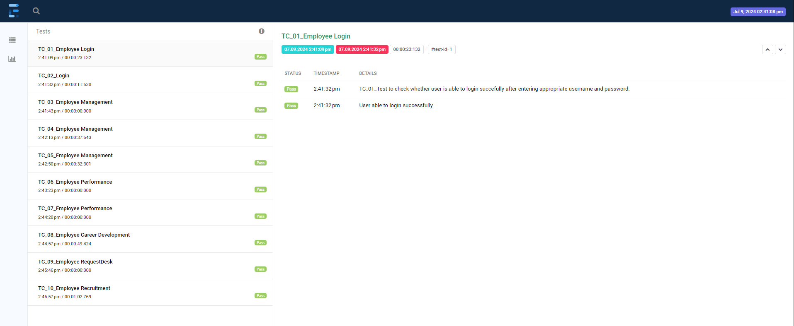

# Selenium Web Automation - Java


Welcome to the Selenium Web Automation project for automating the OrangeHRM platform. This project showcases a comprehensive test automation suite developed using Selenium and Java.

## Project Overview

This project aims to automate the key functionalities of the OrangeHRM Human Resource Management platform. It includes tests for:

- Employee Management
- Performance Management
- Career Development
- Request Desk

## Features

- **Automated Tests**: Developed using Selenium WebDriver and Java.
- **Test Reports**: Generated using ExtentReports for detailed insights on test execution.
- **CI/CD Integration**: Compatible with Jenkins for continuous integration and continuous deployment.

## Prerequisites

- Java JDK 8 or higher
- Maven
- Selenium WebDriver
- ExtentReports
- TestNG

## Getting Started

1. **Clone the repository**:
    ```sh
    git clone https://github.com/SourabhKokitkar/Selenium-Web-Automation-Java.git
    cd Selenium-Web-Automation-Java
    ```

2. **Install dependencies**:
    ```sh
    mvn clean install
    ```

3. **Run the tests**:
    ```sh
    mvn test
    ```

4. **View Test Reports**:
    Open `extentreports.html` in your browser to see the detailed test execution reports.

## Sample Test Report



## Contributing

Feel free to fork this project, submit issues, and send pull requests.


## Contact

For any queries or feedback, please reach out to:

- [LinkedIn](https://www.linkedin.com/in/sourabh-kokitkar/)
- [GitHub](https://github.com/SourabhKokitkar)
